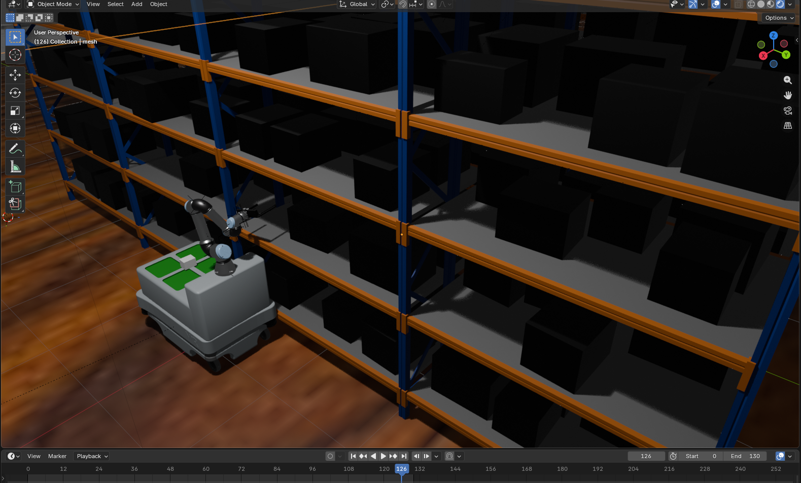
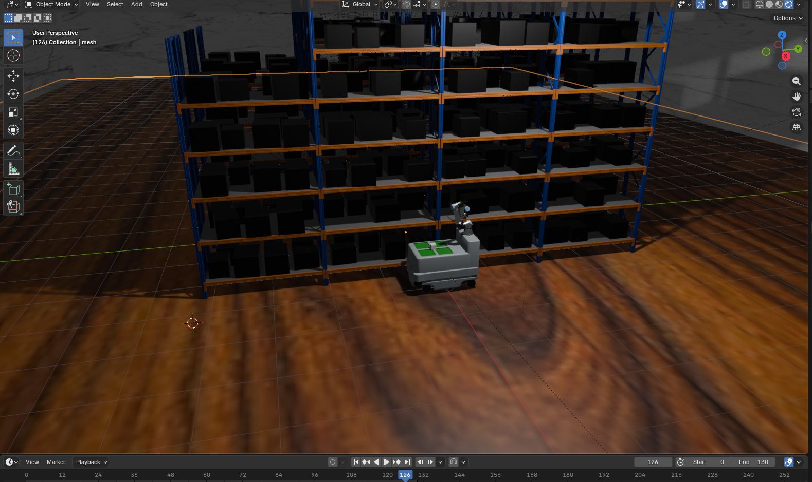

# OpenUSD Experiments

A collection of robotics and simulation experiments built using **OpenUSD (Universal Scene Description)** and Python.

This repository contains different scenarios where robots, cobots, warehouses, moving objects, and USD scenes are generated programmatically. The objective of this project is to explore the capabilities of **OpenUSD** for robotics simulation, digital twins, procedural scene generation, and automation workflows.

---

# Project Overview

This repository demonstrates how to:

- Build complete USD scenes using Python.
- Create warehouse environments.
- Generate robotic manipulation scenarios.
- Simulate robot and cobot movements.
- Animate objects inside OpenUSD scenes.
- Organize reusable USD assets.
- Experiment with procedural scene creation.

The project focuses on creating scalable and modular USD environments that can be integrated into robotics simulation pipelines.

---

# Technologies

- Python
- OpenUSD (Universal Scene Description)
- Pixar USD API
- Robotics Simulation
- Procedural Scene Generation
- Digital Twins

---

# Features

- Procedural USD scene creation
- Robot and cobot simulations
- Warehouse scenarios
- Object manipulation examples
- Animated trajectories
- Asset management
- Modular Python scripts
- Easy to extend with new environments

---

# Repository Structure

```
OpenUsd_experiments/

├── AllCodeJoinForScenario.py
├── Final_Robot_Cobot_Moving_ScenarioWarehouse.py
├── FirstScenarioRackCobot.py
├── cobotTakingCube.py
├── descargarAssets.py
├── ellipseMovement.py
├── movimiento_de_esfera.py
├── moving_sphereRobot.py
├── nave_robot_v2.py
├── robotCarSimulation.py
├── tractorsUsdViewColors.py
├── robotCobot.png
└── robotCobotTwo.png
```

---

# Example Scene

## Robot and Cobot Warehouse



This scenario demonstrates a robotic manipulation environment where a collaborative robot (cobot) operates inside a warehouse built entirely using OpenUSD primitives and assets.

---

## Robot Motion



The scene includes procedural robot movement, object interaction, and environment composition using Python scripts and the OpenUSD API.

---

# Why OpenUSD?

OpenUSD (Universal Scene Description) provides a powerful framework for building large-scale 3D environments.

Some advantages include:

- High-performance scene composition
- Non-destructive editing
- Layer-based workflows
- Asset referencing
- Large environment scalability
- Excellent interoperability with simulation platforms

This repository explores these capabilities through robotics-focused examples.

---

# Future Work

- Physics integration
- Isaac Sim compatibility
- ROS2 integration
- Motion planning
- Digital Twin workflows
- AI-powered robotics scenarios
- Multi-robot environments

---

# Author

**Erick Chicatto**

GitHub:
https://github.com/erickchicatto1

---

# License

This project is released under the MIT License.
